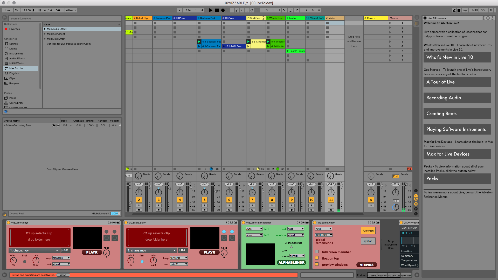

## Tacitrune
Taciturne is an audio-visual performance that reflects personal journey through four different themes: chaos, childhood, tenacity and tacitrune. 

- [Initial plan](https://www.dropbox.com/s/t9125izpwx3b7a7/LIPP_Yueping%26Yunho.pdf?dl=0)
- [Full version mov](https://www.youtube.com/watch?v=5IkgWBvUBzk)
- Final Max file: 04MultisourceTransition.maxpat

## Ableton Live Part
- At the Z.Video tab, I designed a custom VJing system using VIZZable. 
- 
